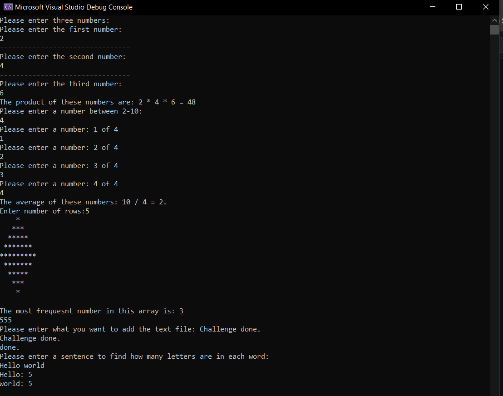
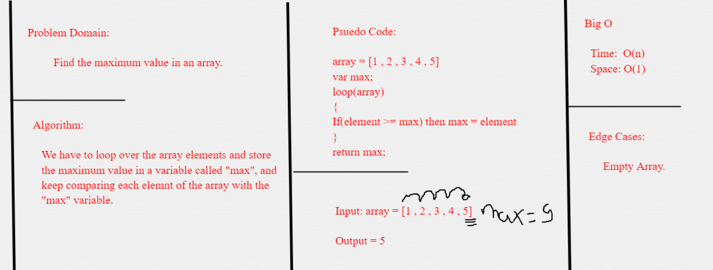

# Lab03-System.IO

## Description

This application is a console application that solves 9 challenges with C# each one with different approach and it also helps use to learn about the System.IO

### Getting Started
Clone this repository to your local machine.

```
$ git clone [repo clone url here]
```

### To run the program from Visual Studio:
Select ```File``` -> ```Open``` -> ```Project/Solution```

Next navigate to the location you cloned the Repository.

Double click on the ```Lab03-System.IO``` directory.

Then select and open ```Lab03-System.IO.sln```


#### Using the Application

#### WhiteBoard Challenge05
